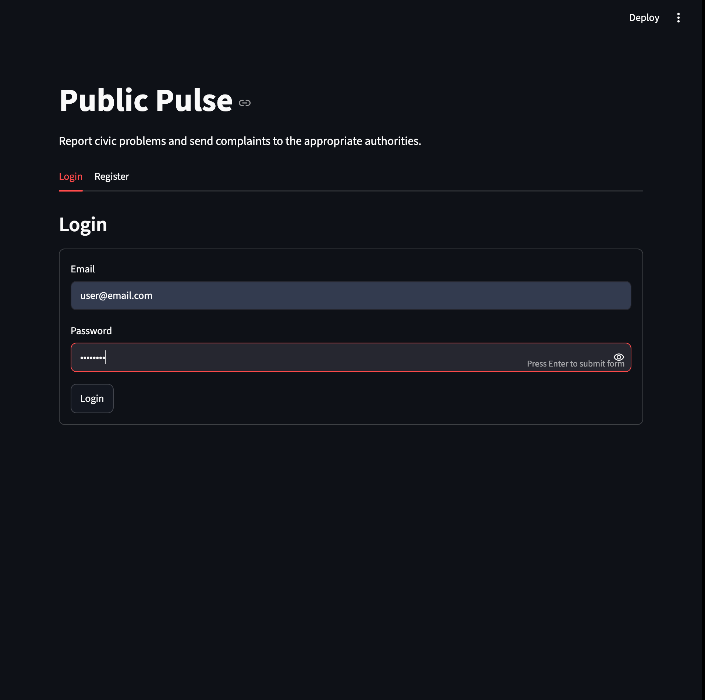
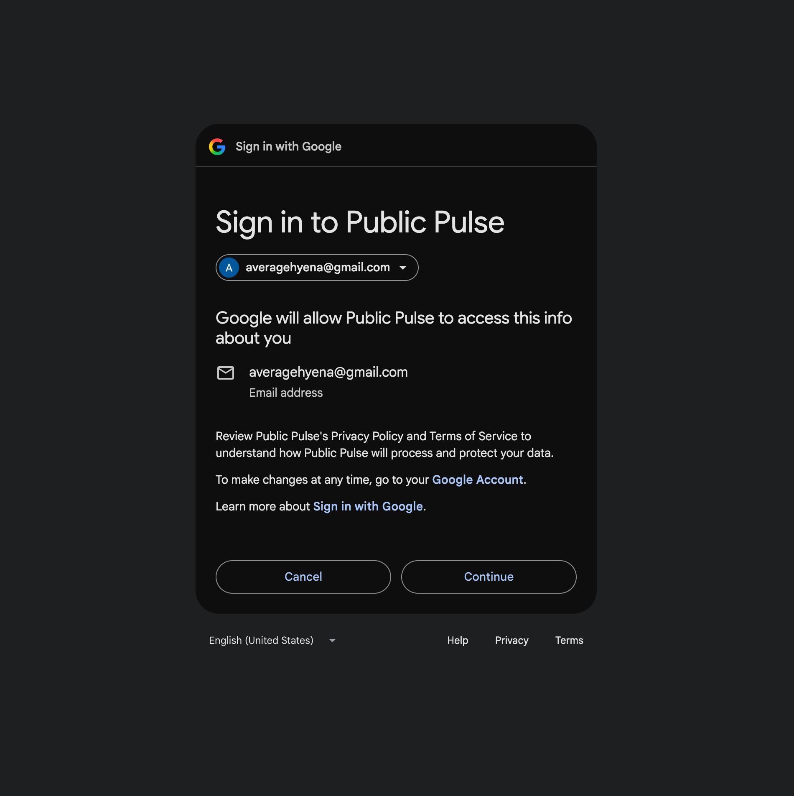
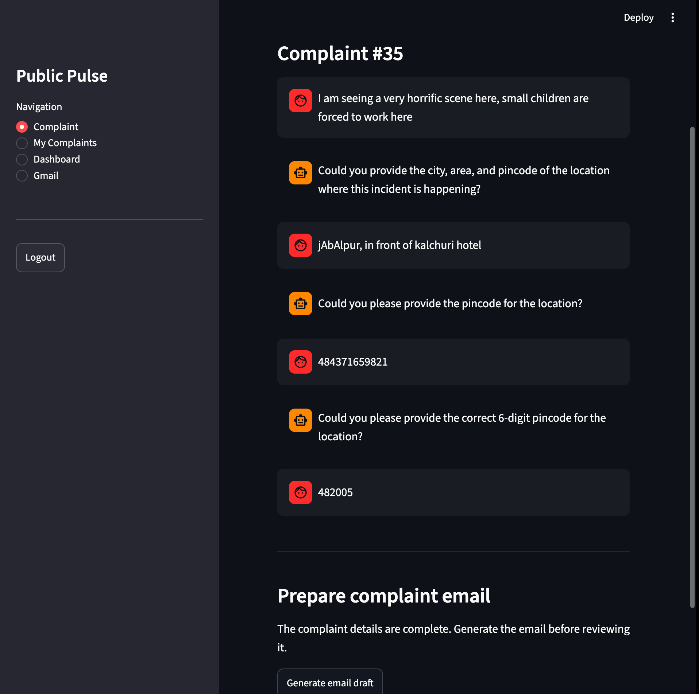
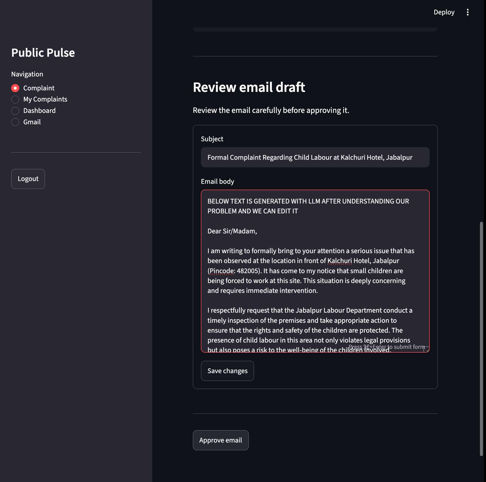
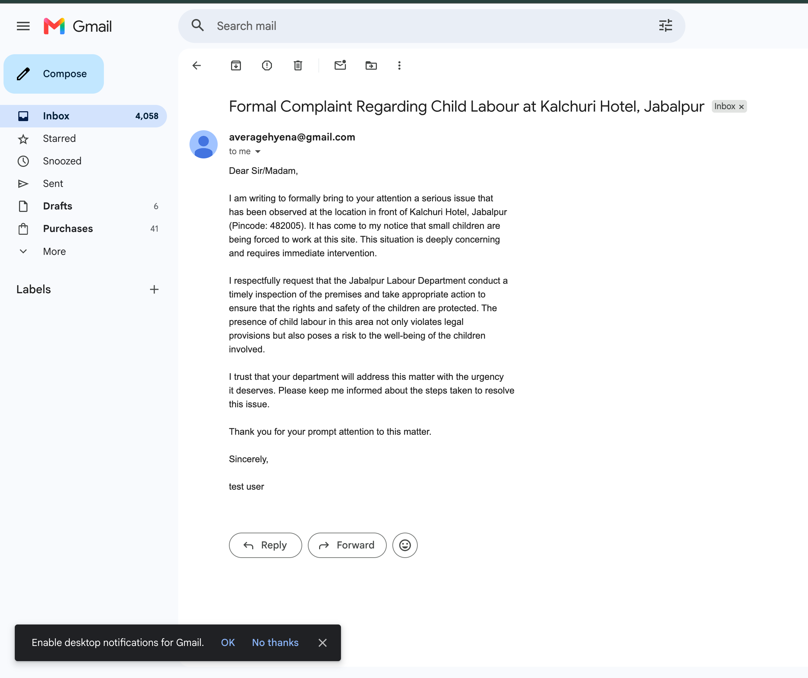
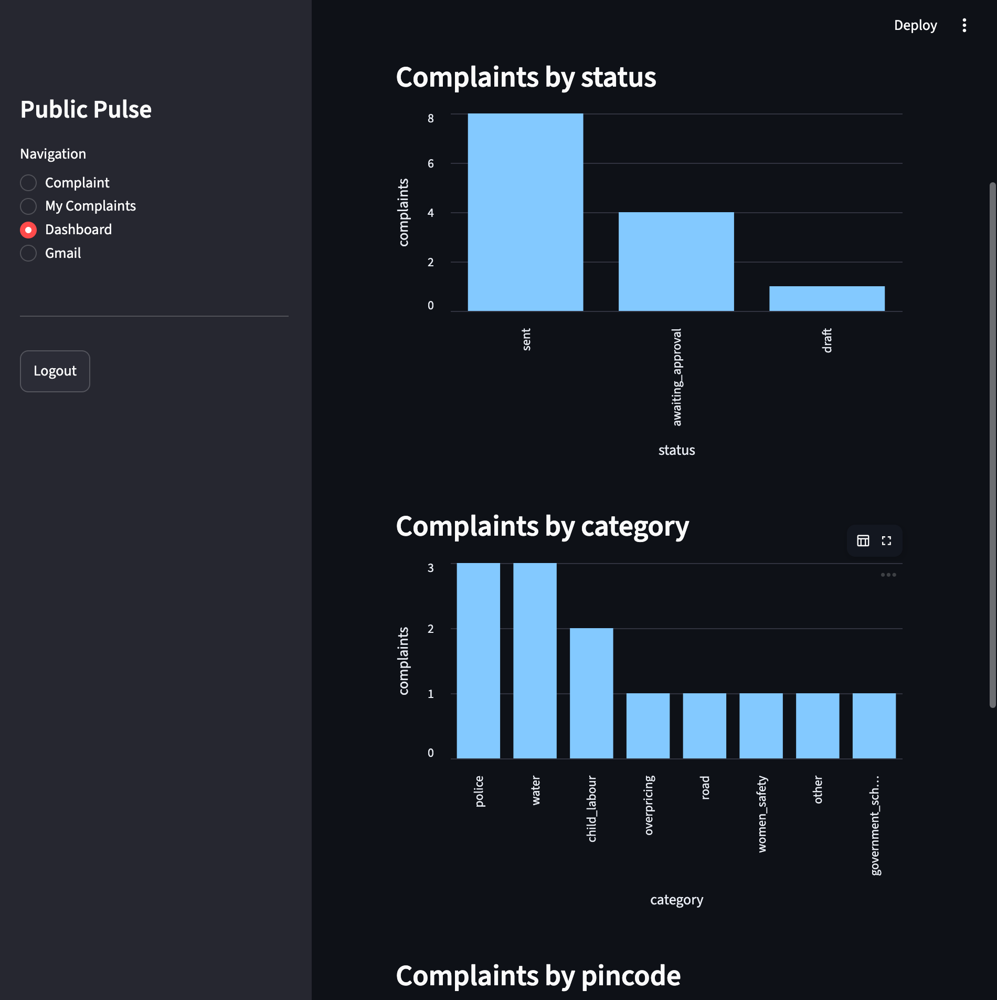

# Public Pulse
Public pulse is an application which uses AI to solve a bunch of our problems
related to social issues, government administration etc.

It also helps the ground reporters(journalists) to report the shortcoming of government with authentic public backed data(every user sends email/complaint through their own Gmail account)

Currently in this project, it supports 5 cities across 3 states. So a user can complaint for these areas only

---

## What Public Pulse Does

A user can

1. Describe a civic problem in natural language.
2. Continue a conversation while the AI asks for missing details.
3. Resolve the city and match the complaint to an authority.
4. Generate a formal complaint email.
5. Review and edit the email.
6. Explicitly approve it.
7. Connect Gmail using OAuth 2.0.
8. Send the approved complaint through the user's own Gmail account.
9. Reopen previous complaints and view their conversation history.
10. Explore aggregate complaint data in the civic dashboard.


The supported complaint categories are:

- Road
- Water
- Electricity
- Sanitation
- Police
- Government school
- Women safety
- Child labour
- Overpricing
- Other

---


---

## How LLM helps us

The LLM analysis service uses the Groq SDK with structured JSON-schema output and Pydantic validation. The current model used is:

```text
openai/gpt-oss-20b
```

The AI extracts:

- summary
- category
- city
- area
- pincode
- missing fields
- next clarification question
- completion state

The backend then resolves canonical location data and authority records rather than trusting the LLM to invent authority information.

---


---
## Demo

### Login page



### Google OAuth 




### Complaint Workflow



### Email Review and Approval




### Sent Email



### Civic Dashboard



---

## Human-in-the-Loop Email Flow

Public Pulse does **not** automatically send an AI-generated complaint.

```text
Structured complaint
        │
        ▼
AI email draft
        │
        ▼
User reviews subject/body
        │
        ├── edit
        │
        ▼
User explicitly approves
        │
        ▼
APPROVED
        │
        ▼
Send through connected Gmail
        │
        ▼
SENT
```

This preserves user control before sending a "bad" email.

---

## Gmail OAuth 2.0 Flow

The good part is that Public Pulse lets users send complaints through their own Gmail account.

Implemented Gmail features include:

- Google OAuth 2.0 authorization
- OAuth state validation
- PKCE
- Google identity verification
- encrypted refresh-token storage
- automatic access-token refresh
- Gmail API sending
- Gmail connection status
- disconnect
- Google token revocation
- redirect back to Streamlit after a successful OAuth callback


---

## Civic Dashboard

Journalists can see the dashboard and report accordingly about an area or particular issue
The dashboard currently aggregates complaints by:

- total complaint count
- current status
- category
- pincode

Time filtering is based on `Complaint.created_at`.

Supported UI options include:

- All time
- Last 7 days
- Last 30 days
- Last 90 days
- Custom number of days from 1 to 365

.

A `resolved` count in that response means complaints **created during that period whose current status is resolved**. It does not mean complaints that became resolved during that period.

Planned v2 analytics include:

- `resolved_at`
- resolution rate
- average resolution time
- status history
- canonical area data
- population data
- per-capita area comparison

---

## Streamlit Frontend

The frontend uses sidebar navigation with separate views for:

- Complaint
- My Complaints
- Dashboard
- Gmail


JWT access tokens are kept in Streamlit session state and attached to protected FastAPI requests as Bearer tokens.


---

## Tech Stack

### Backend

- Python 3.14+
- FastAPI
- Uvicorn
- SQLAlchemy 2.x
- PostgreSQL
- Alembic
- Pydantic v2

### AI

- LangGraph
- Groq Python SDK
- structured JSON-schema LLM outputs
- Pydantic validation

### Authentication & Security

- JWT (`python-jose`)
- `pwdlib` password hashing
- Google OAuth 2.0
- PKCE
- Fernet encryption for stored Google refresh tokens

### Google Integration

- `google-api-python-client`
- `google-auth`
- `google-auth-oauthlib`
- Gmail API


---


## Authentication

Users authenticate with email and password.

A signed JWT is then passed when want to use a protected endpoint

Protected requests use:

```text
Authorization: Bearer <JWT>
```

The backend derives the current user from the validated token rather than accepting a user ID from the client.

---

## Local Setup

To run this project fully it is a little complicated, we are not just hitting an API request. We have to create a project in google cloud, get a client id+client secret, set the required permission(sending email). Sadly even after that since this project is currently in testing phase we can only allow 100 test users which we have to specify in google cloud. Then only we can send the email with those(100) accounts only.

We have shown in demo images how the "working" application looks

### 1. Clone

```bash
git clone https://github.com/iamprakhar10/Public-Pulse.git
cd Public-Pulse
```

### 2. Install dependencies

The project uses `uv`.

```bash
uv sync
```

The project currently requires Python 3.14 or newer according to `pyproject.toml`.

### 3. Create PostgreSQL databases

Development database:

```bash
createdb publicpulse
```

Separate test database:

```bash
createdb publicpulse_test
```

### 4. Configure environment variables

Copy the example:

```bash
cp .env.example .env
```

The current `.env.example` defines:

```env
# PostgreSQL
DATABASE_URL=
TEST_DATABASE_URL=postgresql://username@localhost/publicpulse_test

# Public Pulse authentication
SECRET_KEY=

# LLM provider
GROQ_API_KEY=

# Google OAuth
GOOGLE_CLIENT_ID=
GOOGLE_CLIENT_SECRET=
GOOGLE_REDIRECT_URI=http://127.0.0.1:8000/gmail/callback

# Encryption for stored OAuth refresh tokens
TOKEN_ENCRYPTION_KEY=
```

Fill these with your own local values.

### 5. Apply migrations

```bash
uv run alembic upgrade head
```

### 6. Seed reference data

Seed locations first:

```bash
uv run python -m app.scripts.seed_locations
```

Then authorities:

```bash
uv run python -m app.scripts.seed_authorities
```

If existing complaints need canonical city IDs backfilled:

```bash
uv run python -m app.scripts.backfill_complaint_city_ids
```

---

## Running the Application

Run the backend and frontend in separate terminals from the repository root.

### Terminal 1 — FastAPI

```bash
uv run uvicorn app.main:app --reload
```

API:

```text
http://127.0.0.1:8000
```

Swagger:

```text
http://127.0.0.1:8000/docs
```

### Terminal 2 — Streamlit

```bash
PYTHONPATH=. uv run streamlit run frontend/app.py
```

Frontend:

```text
http://localhost:8501
```

---

## Running Tests

The project uses a separate PostgreSQL test database to keep test cleanup isolated from development data.

Run the complete suite with:

```bash
uv run python -m pytest -v
```

The test suite currently covers areas including:

- authentication
- user CRUD
- complaint CRUD
- complaint routes
- complaint sending workflow
- authority lookup
- location resolution
- token encryption
- Gmail credential CRUD
- OAuth state / PKCE
- Gmail OAuth callback flow
- Gmail connection routes
- Gmail sender
- Google token revocation
- configuration
- database connectivity

There are also manual AI/graph test scripts for selected LLM-dependent workflows.

---


## Repository

**GitHub:** https://github.com/iamprakhar10/Public-Pulse

---


